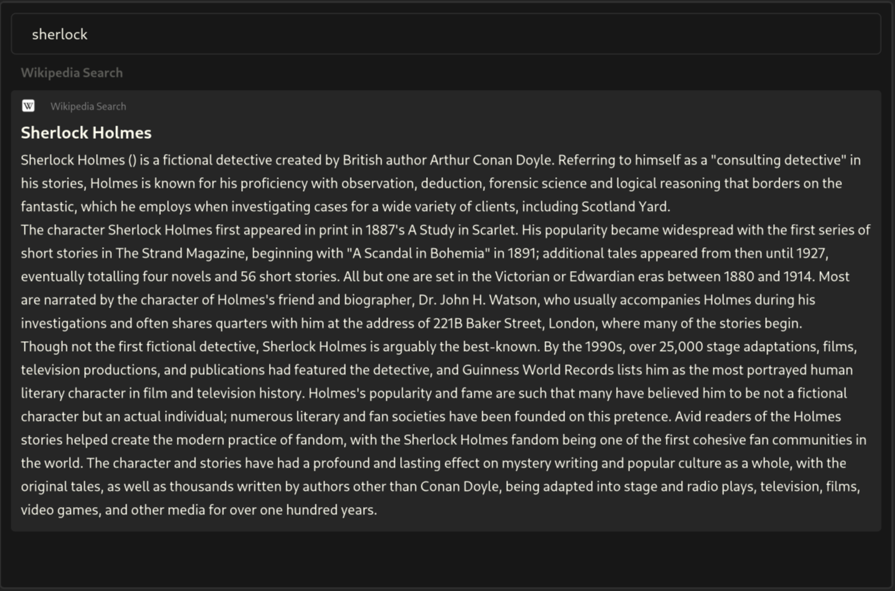

# Sherlock-wiki
Sherlock wiki is a simple script to allow you to make a Wikipedia API request from sherlock directly. 
<div align="center" style="text-align:center;">
  <picture>
    
  </picture>
</div>


## Table of Contents
- [Getting Started](#getting-started)
    - [Dependencies](#dependencies)
    - [Installation](#installation)
        - [Using the Binary](#using-the-binary)
        - [From Source](#from-source)


## Getting Started

### 1. Dependencies 

To run `sherlock-wiki`, ensure the following dependencies are installed:

- `Sherlock Application Launcher` - [Getting Started with Sherlock](https://github.com/Skxxtz/sherlock#getting-started)

Additionally, if you're building from source, you will need:

- `rust` - [How to install rust](https://www.rust-lang.org/tools/install)
<br><br>

### 2. Istallation

#### <ins>Using the Binary</ins>
1. Go to [releases](https://github.com/Skxxtz/sherlock-wiki/releases) and download the latest release
2. Extract the resulting archive
```bash
# Make sure to replace the name with the name of your archive
tar -xvzf sherlock-wiki-v0.1.0-bin-linux-x86_64.tar.gz 
```
3. Move the extracted binary to the sherlock config directory
```bash
mkdir -p ~/.config/sherlock/scripts/
mv sherlock-wiki ~/.config/sherlock/scripts/
```
4. (Optional) Move the `LICENSE` to a directory of your choice or delete it
```bash
sudo mkdir -p /usr/local/share/licenses/sherlock-wiki/
sudo mv LICENSE /usr/local/share/licenses/sherlock-wiki/

# or

rm -rf LICENSE
```
<br>

#### <ins>From Source</ins>
To build `sherlock-wiki` from source, follow these steps.<br>
Make sure you have the necessary dependencies installed:

- `rust` - [How to install rust](https://www.rust-lang.org/tools/install)
- `git` - [How to install git](https://github.com/git-guides/install-git)

1. Clone the repository:
```bash
git clone https://github.com/Skxxtz/sherlock-wiki.git
cd sherlock-wiki
``` 
2. Install necessary Rust dependencies and build the app:
```bash
cargo build --release
```
3. Install the inary:
```bash
mkdir -p ~/.config/sherlock/scripts/
cp target/release/sherlock-wiki ~/.config/sherlock/scripts/
```

### Post Installation
You can now refer to `sherlock-wiki` in your `fallback.json` file like so:
```
    {
        "name": "Wikipedia Search",
        "alias": "wiki",
        "type": "bulk_text",
        "on_return": "next",
        "async": true, 
        "args": {"icon": "wikipedia", "exec": "/home/basti/.config/sherlock/scripts/sherlock-wiki", "exec-args": "'{keyword}'"},
        "priority": 0 
    }
```
> 💡 **NOTE:** to use an icon that's not included in your standard icon theme you must set a custom icon path within your `config.toml` file. See [Example Config](https://github.com/Skxxtz/sherlock/blob/main/docs/examples/config.toml)
